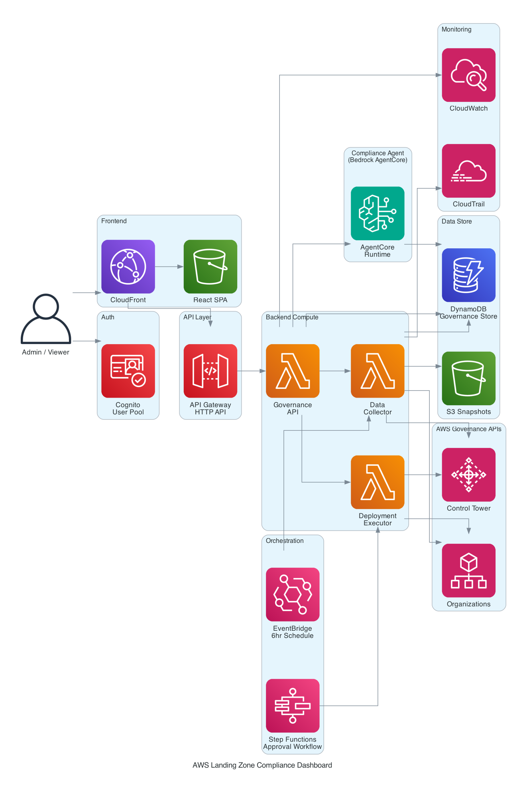
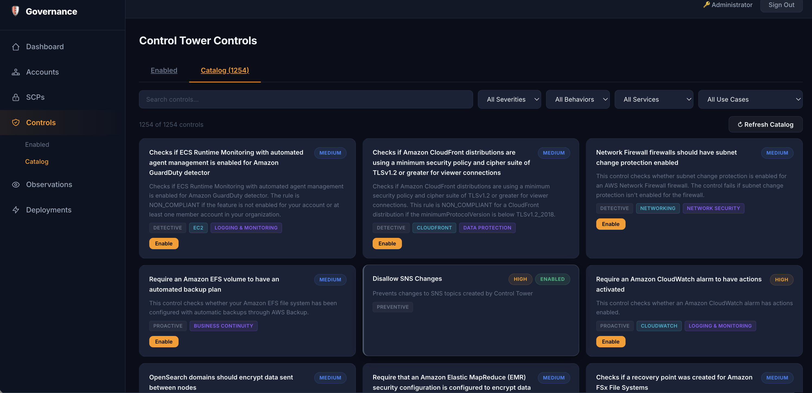

# AWS Landing Zone Compliance Dashboard

## Objective

The primary objective of this solution is to add a **compliance layer** to AWS Landing Zone controls. While the foundational features provide visibility into how the AWS Organization is set up — accounts, OUs, SCPs, and Control Tower guardrails — the real value-add is the **Observations layer**, powered by an autonomous AI agent that evaluates governance posture against regulatory frameworks.

The agent runs on **Bedrock AgentCore Runtime** and produces per-account compliance observations mapped to:

- **NIST Cybersecurity Framework (CSF) v2.0** — Govern, Identify, Protect, Detect, Respond, Recover
- **RBI Master Direction on IT Governance** — Chapters 3-8 covering IT Governance, Infrastructure & Security, Operations, IS Audit, Business Continuity, and Vendor Management

Each observation includes the specific NIST control (e.g., `DE.CM-02 — Continuous Monitoring`) and RBI directive (e.g., `RBI 6.1 — Audit Logging`) it addresses, along with the objective description and a recommended remediation action.

## Architecture



## Dashboard Preview



### Application 1 — Governance Dashboard

A serverless web application that aggregates and displays data from AWS Control Tower and AWS Organizations.

| Component | Service | Purpose |
|-----------|---------|---------|
| Frontend | S3 + CloudFront | React SPA with dark security theme |
| Auth | Cognito User Pool | Role-based access (viewer / administrator) |
| API | API Gateway HTTP API | 16 REST endpoints with JWT authorization |
| Compute | Lambda (Python) | Governance API, Data Collector, Deployment Executor |
| Data | DynamoDB (single-table) | Governance store with GSI for queries |
| Snapshots | S3 | Point-in-time JSON governance snapshots |
| Orchestration | Step Functions | Deployment approval workflows |
| Scheduling | EventBridge | Automated data collection every 6 hours |
| Monitoring | CloudWatch + CloudTrail | Alarms and audit logging |

**Key Features:**
- Organization tree with OU hierarchy visualization
- Accounts table with click-to-expand showing controls and SCPs per account
- Full Control Tower catalog (1200+ controls) with filters by severity, behavior, service, and use case
- SCP management with attach/detach capabilities
- Direct control enablement from the catalog (no approval workflow needed)
- Data collection refresh on demand

### Application 2 — Autonomous Compliance Agent

A Strands Agents SDK agent deployed as a container on **Bedrock AgentCore Runtime**.

| Component | Service | Purpose |
|-----------|---------|---------|
| Runtime | Bedrock AgentCore | Container-based agent hosting (ARM64) |
| Model | Amazon Nova Pro | LLM for compliance evaluation |
| Agent SDK | Strands Agents | Tool-use agent orchestration |
| Container | ECR | Docker image with pre-installed dependencies |
| Build | CodeBuild | ARM64 container builds |

**How it works:**
1. User clicks "Run Evaluation" on the Observations page
2. Governance API invokes AgentCore `invoke_agent_runtime`
3. Agent reads accounts, controls, and SCPs directly from DynamoDB
4. Agent evaluates each account against NIST CSF and RBI Master Direction
5. Agent writes severity-rated observations to DynamoDB with framework references
6. Dashboard auto-refreshes and displays observations grouped by severity

**Framework Coverage:**
- NIST CSF: GV (Govern), ID (Identify), PR (Protect), DE (Detect), RS (Respond), RC (Recover)
- RBI: Chapter 3 (IT Governance), Chapter 4 (Infrastructure & Security), Chapter 5 (Operations), Chapter 6 (IS Audit), Chapter 7 (Business Continuity), Chapter 8 (Vendor Management)

## Tech Stack

- **Backend:** Python 3.12, boto3, Strands Agents SDK
- **Frontend:** React 18, TypeScript, Vite
- **Infrastructure:** AWS CDK (Python)
- **Agent Runtime:** Bedrock AgentCore (container-based)
- **Model:** Amazon Nova Pro (on-demand)

## Deployment

```bash
# Install dependencies
cd frontend && npm install && npm run build && cd ..
pip install -r requirements.txt

# Deploy infrastructure
cdk deploy

# Trigger initial data collection
aws lambda invoke --function-name <DataCollectorFunction> --payload '{"source":"manual"}' /dev/stdout
```

## Estimated Monthly Cost (us-east-1)

Cost estimate assumes light-to-moderate usage: ~5 users, data collection every 6 hours, 2 compliance evaluations per week, ~500 API requests/day.

| Service | Usage Assumption | Unit Price | Monthly Cost |
|---------|-----------------|------------|-------------|
| Lambda (Governance API) | ~15,000 requests, 128MB, avg 500ms | $0.20/1M requests + $0.0000166667/GB-s | ~$0.15 |
| Lambda (Data Collector) | ~120 invocations, 512MB, avg 30s | Same as above | ~$0.03 |
| Lambda (Deployment Executor) | ~50 invocations, 128MB, avg 3s | Same as above | ~$0.01 |
| DynamoDB (on-demand) | ~50K reads, ~5K writes/month | $0.25/1M RRU, $1.25/1M WRU | ~$0.02 |
| API Gateway (HTTP API) | ~15,000 requests | $1.00/1M requests | ~$0.02 |
| S3 (frontend + snapshots) | ~1GB storage, ~10K requests | $0.023/GB + $0.0004/1K GET | ~$0.03 |
| CloudFront | ~5GB transfer, ~50K requests | $0.085/GB + $0.0100/10K | ~$0.48 |
| Cognito | 5 users (free tier: 50K MAU) | Free | $0.00 |
| Step Functions | ~50 state transitions | Free tier: 4,000/month | $0.00 |
| EventBridge | ~120 scheduled events | Free tier: included | $0.00 |
| CloudWatch | Alarms + logs (~1GB) | $0.30/alarm + $0.50/GB ingested | ~$1.40 |
| CloudTrail | 1 trail (management events free) | Free (1 trail) | $0.00 |
| **Bedrock AgentCore Runtime** | ~8 sessions/month, ~2 min active CPU each, 512MB peak memory | $0.0895/vCPU-hr (CPU) + $0.00945/GB-hr (memory) | ~$0.05 |
| **Bedrock (Nova Pro)** | ~8 evaluations, ~50K input + ~10K output tokens each | $0.80/1M input, $3.20/1M output | ~$0.58 |
| ECR | ~500MB image storage | $0.10/GB/month | ~$0.05 |
| CodeBuild (ARM) | ~4 builds/month, ~3 min each | $0.0034/build-min (general1.small) | ~$0.04 |

**Estimated total: ~$2.86/month**

Most services fall within or near the AWS Free Tier for this usage level. The primary cost drivers at scale would be Bedrock model invocations (if running evaluations frequently) and DynamoDB (if the organization has hundreds of accounts). For a large organization with 500+ accounts and daily evaluations, expect ~$15-25/month.

Sources: [Lambda](https://aws.amazon.com/lambda/pricing/), [DynamoDB](https://aws.amazon.com/dynamodb/pricing/on-demand/), [API Gateway](https://aws.amazon.com/api-gateway/pricing/), [Bedrock](https://aws.amazon.com/bedrock/pricing/), [AgentCore](https://aws.amazon.com/bedrock/agentcore/pricing/), [CloudFront](https://aws.amazon.com/cloudfront/pricing/)

## Deployment

```bash
# Install dependencies
cd frontend && npm install && npm run build && cd ..
pip install -r requirements.txt

# Deploy infrastructure
cdk deploy

# Trigger initial data collection
aws lambda invoke --function-name <DataCollectorFunction> --payload '{"source":"manual"}' /dev/stdout
```
